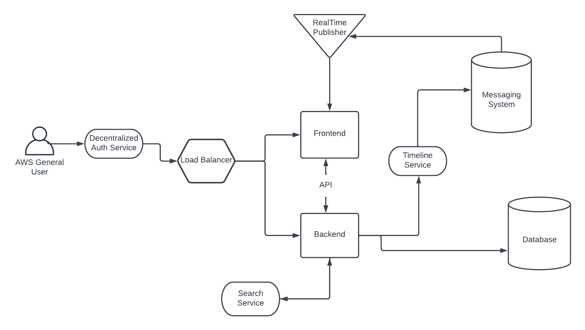
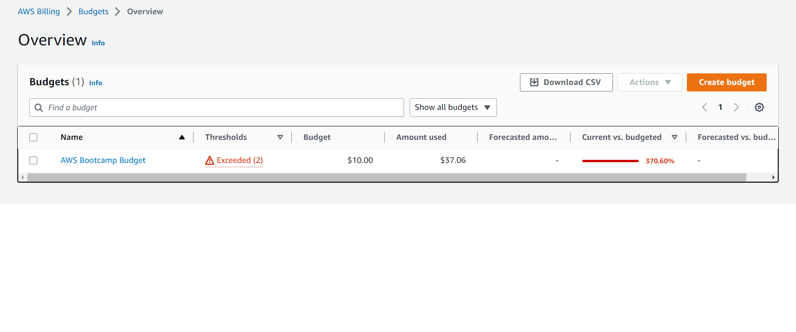

# Week 0 — Billing and Architecture

## Required Homework

### Recreate Conceptual Diagram in Lucid Charts or on a Napkin

[Conceptual Follow-Along Diagram Link](https://lucid.app/lucidchart/a620a0c4-17ef-4697-bf9d-0e312701b361/edit?viewport_loc=-11%2C66%2C1935%2C961%2C0_0&invitationId=inv_9eda1340-2683-4c68-ad04-af47c55ab27b)

### Recreate Logical Architectual Diagram in Lucid Charts

[Crudder Logical Diagram Lucid Charts Link](https://lucid.app/lucidchart/ae94cc5c-8761-4240-992f-50d615b3b9c7/edit?viewport_loc=-1840%2C-626%2C4354%2C2334%2C0_0&invitationId=inv_d37dcab1-d239-450f-be20-2be6ca524fa8)

### Create a Budget

I created a $10 budget and immediately triggered the alarm buying domains. In spite of that I only created the one budget to limit spend until necessary. I followed 
along and added the CLI jsons to my repo but did not execute them.   

